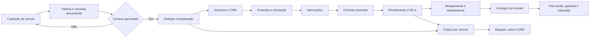

# Diagnóstico de módulos para operação completa de revenda

**Produto:** Trmotors Hub  
**Data:** 12 de agosto de 2026  
**Autoria:** Manus AI

## Síntese executiva

O **Trmotors Hub já possui uma base operacional acima do estágio inicial de um ERP para revenda**. O sistema cobre a maior parte do caminho comercial: captação e acompanhamento de leads, vistoria de compra, entrada e gestão de estoque, proposta com aprovações, documentação/despachante, entrega, despesas, pessoas, treinamentos e governança de acessos. Também já há recursos importantes para preservar o histórico de aprovações, controlar pendências documentais e separar permissões por perfil.

O principal ponto de evolução não é criar mais telas isoladas. É **fechar a esteira econômica, fiscal, contratual e documental de cada veículo**, do momento em que ele é avaliado para compra até o recebimento integral, a transferência concluída e o pós-venda. Hoje, a operação registra dados relevantes, mas ainda não transforma toda a cadeia em uma fonte única de verdade para margem, caixa, impostos, contratos, portais e alertas.

> **Recomendação central:** priorizar primeiro o núcleo de resultado por veículo — financeiro, fiscal, contratos e documentação — e somente depois ampliar canais de venda, consultas externas e integrações bancárias.

## Cobertura atual por etapa operacional

| Etapa da operação | Cobertura atual no Trmotors Hub | Situação | Principal lacuna para a etapa |
|---|---|---:|---|
| Captação e qualificação | Pipeline CRM, origem do lead, responsável, follow-up e interesse por veículo | Boa | Agenda de atividades, histórico de conversas e alertas automáticos ainda não são centralizados. |
| Compra e avaliação | Vistoria de compra com condições, fotos, FIPE, avaliação e valor de aquisição | Boa | Consulta externa de débitos, restrições, histórico e decisão formal de compra/permuta. |
| Entrada e preparação | Estoque com preço de compra, recondicionamento, preço de venda, fotos e status | Parcial | Ordens de preparação/oficina, fornecedores, peças, prazos e custo real acumulado do veículo. |
| Anúncio e geração de demanda | Fotos e dados ricos no estoque; CRM registra origem “portal” | Parcial | Publicação, atualização e retirada automáticas em Webmotors, OLX, iCarros e site próprio. |
| Negociação | Pipeline, valores propostos, entrada, troca e campos de financiamento | Boa | Simulador comparativo, proposta comercial formal e envio rastreável ao cliente. |
| Aprovação de venda | Aprovação paralela por Financeiro e Administrativo, histórico e checklists | Boa | Regras de alçada, bloqueios por margem/pendência e notificações por SLA. |
| Financeiro | Despesas, comissões, NF PJ mensal e conferência de pagamentos | Parcial | Contas a pagar/receber, conciliação, fluxo de caixa, DRE, margem por veículo e baixa integrada da venda. |
| Fiscal | Há referência de módulo fiscal no cadastro de módulos | Ausente/inativo | Emissão, consulta, cancelamento e armazenamento de NF-e vinculada à venda. |
| Contratos | Upload de documentos e confirmação no checklist de entrega | Parcial | Geração de contrato a partir da proposta, assinatura eletrônica, trilha de auditoria e guarda do documento final. |
| Transferência e despachante | Checklist de documentos, serviços, status, e-mail e WhatsApp | Boa | Vínculo obrigatório com venda/veículo, prazos, pendências e acompanhamento da ATPV-e/DETRAN. |
| Entrega | Agendamento, checklist, fotos, hodômetro, combustível e assinatura registrada | Boa | Dossiê único de entrega, pesquisa de satisfação e gatilho de pós-venda/garantia. |
| Pós-venda | Não há módulo dedicado | Ausente | Garantias, revisões prometidas, relacionamento, indicação, NPS e tratamento de ocorrências. |
| Gestão e governança | Dashboard, auditoria, administração de usuários, RH e EAD | Parcial | Relatórios executivos/exportação, indicadores por unidade e permissões por perfil + módulos adicionais. |

## O fluxo-alvo recomendado

O fluxo abaixo reorganiza os módulos existentes e indica os pontos que precisam ser conectados. A intenção é que cada veículo tenha um **dossiê operacional único**, composto por origem, custos, documentos, negociação, fiscal, transferência e entrega.

O módulo de despachante já oferece uma base relevante para a etapa documental. Contudo, a transferência digital não elimina o acompanhamento da operação: a SENATRAN descreve assinatura da autorização de transferência na Carteira Digital de Trânsito e, depois, vistoria e transferência no DETRAN. O dossiê deve manter responsáveis, status, prazos, documentos e evidências desses marcos.[1]

## Lacunas prioritárias

### Prioridade 1 — fechar a operação e o resultado por veículo

| Módulo / evolução | Problema que resolve | Escopo inicial recomendado | Dependências | Resultado esperado |
|---|---|---|---|---|
| **Financeiro operacional e rentabilidade por veículo** | A venda aprovada não fecha automaticamente contas a receber, custos, comissão, margem e caixa. | Plano de contas; contas a pagar/receber; parcelas, sinal e recebimentos; centro de custo; conciliação manual inicial; custo e margem por veículo; DRE mensal e exportação CSV/XLSX. | Vínculo consistente entre estoque, vendas, despesas, comissões e NF PJ. | Gestão passa a saber quanto cada veículo realmente gerou de margem e o caixa previsto. |
| **NF-e integrada à venda** | Emissão fiscal fica fora do fluxo comercial, cria retrabalho e pode deixar a venda sem dossiê fiscal. | Dados fiscais do cliente; pré-validação; emissão por integração homologada; XML/DANFE; consulta de status; cancelamento; vínculo à venda e ao financeiro. | Certificado digital, definição tributária e integração com emissor/SEFAZ. | Venda aprovada só avança quando o faturamento fiscal estiver controlado. |
| **Contratos com assinatura eletrônica** | Documentos podem ser enviados e anexados, mas não há uma trilha contratual completa. | Templates por tipo de negociação; preenchimento automático pela proposta; signatários; envio por WhatsApp/e-mail; status; evidências; PDF final imutável. | Dados completos de cliente, veículo e proposta; provedor de assinatura. | Redução de erro de digitação e rastreabilidade do aceite. |
| **Central de tarefas, alertas e SLAs** | Pendências dependem de consulta manual a módulos diferentes. | Caixa de tarefas por usuário; prazos; lembretes no sistema e e-mail/WhatsApp; escalonamento para gestor; alertas de proposta parada, documento pendente, NF sem pagamento e entrega próxima. | Eventos dos módulos atuais e regras de responsabilidade. | Menos perda de prazo e gestão por exceção. |
| **Dossiê do veículo e da venda** | Informações críticas estão espalhadas entre vistoria, estoque, CRM, proposta, despachante, financeiro e entrega. | Linha do tempo; checklists obrigatórios; documentos; custos; contratos; NF-e; transferência; auditoria; status consolidado. | Chaves de relacionamento entre veículo, lead, venda e documento. | Uma única tela responde “onde está este veículo e o que falta para concluir”. |

> O Portal Nacional da NF-e apresenta a nota fiscal eletrônica como documento com validade jurídica e como substituição do modelo em papel, além de manter serviços e documentação técnica. Por isso, a emissão fiscal deve ser tratada como etapa integrada, e não como simples arquivo anexado no final do processo.[2]

### Prioridade 2 — aumentar conversão, velocidade e qualidade da compra

| Módulo / evolução | Problema que resolve | Escopo inicial recomendado | Ganho operacional |
|---|---|---|---|
| **Simulador de financiamento e propostas comparativas** | Os campos de financiamento existentes não calculam cenários nem registram a proposta final do banco. | Entrada, prazo, taxa/CET informado, parcela estimada, valor financiado, comparação de cenários e aprovação do cliente. | Vendedor negocia com parâmetros consistentes antes da formalização bancária. |
| **Consulta veicular e decisão de compra** | A vistoria não substitui consulta de débitos, gravames, restrições e histórico. | Consulta sob demanda via provedor contratado; retorno anexado ao dossiê; checklist de decisão; bloqueio por ocorrência crítica. | Menor risco de adquirir veículo com passivo documental ou financeiro. |
| **Preparação, oficina e fornecedores** | Recondicionamento existe como valor, mas não como processo controlado. | Ordem de serviço por veículo; itens, fornecedor, orçamento, prazo, aprovação, custo previsto x realizado e status de liberação para fotos/anúncio. | Reduz carros parados e torna o custo de preparação auditável. |
| **Integração com portais e site de estoque** | Cadastro/fotos podem ser replicados manualmente e anúncios podem permanecer ativos após reserva ou venda. | Publicação de estoque; mapeamento de campos/fotos; status de anúncio; log de sincronização; despublicação ao vender/reservar. Começar por um portal ou integrador. | Menos retrabalho e risco de anunciar veículo indisponível. |
| **Relatórios e exportações gerenciais** | Dashboard operacional não substitui fechamento e análise de desempenho. | Funil por origem/vendedor, aging de estoque, margem, despesas, contas em atraso, conversão, comissão e produtividade; filtros; CSV/XLSX/PDF. | Gerência decide com dados de caixa, giro e conversão. |

Soluções especializadas do segmento costumam combinar estoque, CRM, financeiro, site e distribuição para portais como proposta competitiva. O Trmotors Hub já cobre parte substantiva dessa base; a prioridade deve ser conectar esses blocos antes de tentar suportar todos os portais simultaneamente.[3]

### Prioridade 3 — escala, fidelização e expansão

| Módulo / evolução | Escopo recomendado | Observação de prioridade |
|---|---|---|
| **Pós-venda, garantia e relacionamento** | Registro de garantia, serviços prometidos, lembrete de revisão, pesquisa de satisfação, indicação e nova compra. | Alto valor comercial, porém depende do dossiê de venda confiável. |
| **Multiunidade e transferências internas** | Filiais, pátios, estoque por unidade, metas, permissões por unidade e transferências. | Só iniciar quando houver necessidade real de mais de uma unidade. |
| **Integrações bancárias e financeiras** | Retorno de boleto/PIX, conciliação automática, formalização de propostas de crédito e acompanhamento bancário. | Iniciar depois que o financeiro interno e o simulador estiverem estáveis. |
| **Aplicativo móvel completo** | Disponibilização orientada por módulo de ações de campo: fotos, vistoria, CRM, tarefas, documentos e entrega. | O app deve replicar primeiro os fluxos que exigem mobilidade; não simplesmente copiar toda a interface web. |
| **BI avançado e previsão** | Metas, comparativos, previsão de caixa, previsão de vendas e indicadores por canal. | Vem depois da qualidade do dado e dos relatórios operacionais. |

## Fundamentos transversais obrigatórios

Os itens abaixo não devem virar funcionalidades isoladas. Eles precisam acompanhar todas as prioridades para que o sistema continue confiável quando ganhar integrações e novas unidades.

| Fundamento | Situação atual | Recomendação |
|---|---|---|
| **Perfis e módulos adicionais** | Há perfis principais; a regra “perfil base + módulo extra”, como Vendedor + EAD, está pendente. | Implementar `extraModules` por usuário, sempre validando acesso no servidor, na navegação e no app mobile. |
| **Auditoria e histórico** | Há histórico de aprovações e área administrativa de auditoria. | Padronizar eventos para mudança de status, emissão/cancelamento fiscal, assinatura, arquivos, baixa financeira e alteração de margem. |
| **Armazenamento de arquivos** | Parte dos documentos já é registrada; alguns campos técnicos ainda mencionam URI local/base64. | Centralizar em armazenamento privado, com URL assinada, versão do arquivo, tipo, retenção e vínculo com o dossiê. |
| **Segurança e LGPD** | Há controle de acesso por perfil e dados sensíveis de clientes/colaboradores. | Matriz de acesso, logs, revisão de permissões, política de retenção, backup testado e processo de incidente. A ANPD disponibiliza guia e checklist de segurança para agentes de tratamento de pequeno porte.[5] |
| **Contratos e evidências** | O checklist de entrega armazena assinatura, mas não uma jornada contratual completa. | Registrar provedor, hash/identificador, data/hora, IP quando disponibilizado, signatários e PDF assinado. Assinaturas eletrônicas são reconhecidas legalmente no Brasil, mas o nível adequado deve ser definido conforme o documento e a aceitação das partes.[4] |
| **Paginação, busca e desempenho** | Listagens tendem a crescer com veículos, leads, despesas e documentos. | Padronizar paginação server-side, filtros salvos, busca indexada, ordenação e carregamento progressivo em todas as listas. |

## Ordem recomendada de implementação

| Onda | Conteúdo | Critério de saída |
|---|---|---|
| **Onda 0 — governança de acesso** | Perfil principal + módulos adicionais; configurar Danilo como vendedor; regra única de permissão no web e app. | Usuário recebe apenas os módulos liberados, mesmo que tente acessar uma rota diretamente. |
| **Onda 1 — dossiê e alertas** | Relacionar veículo, lead, proposta, venda, documentos, despachante e entrega; central de tarefas. | Cada venda exibe status consolidado, pendências, responsável e prazo. |
| **Onda 2 — financeiro de verdade** | Contas a pagar/receber, fluxo de caixa, comissão, custos por veículo, margem e DRE/exportação. | Fechamento mensal e margem de cada veículo podem ser apurados sem planilha paralela. |
| **Onda 3 — fiscal e contratos** | NF-e integrada, contratos por template, assinatura eletrônica e armazenamento de evidências. | A venda só pode ser entregue com contrato, faturamento e documentos obrigatórios rastreados. |
| **Onda 4 — preparação, crédito e canais** | Ordens de preparação; simulador; consulta veicular; primeiro portal/site. | Veículo percorre compra, preparação, anúncio, negociação e venda com dados consistentes. |
| **Onda 5 — relacionamento e escala** | Pós-venda, garantia, multiunidade, integrações bancárias e BI preditivo. | Plataforma preparada para aumento de unidades, canais e volume. |

## Decisões de produto recomendadas

O módulo chamado “Financeiro” não deve permanecer somente como painel de aprovação. Ele deve evoluir para uma **central de resultado e caixa**, enquanto as aprovações continuam uma subetapa da venda. Da mesma maneira, o módulo de despachante deve deixar de ser uma fila independente e passar a fazer parte obrigatória do dossiê de cada venda que exigir transferência.

Não é recomendável começar por integração simultânea com todos os bancos, portais, DETRANs e assinadores. O caminho seguro é definir um modelo de dados canônico — veículo, cliente, negociação, contrato, pagamento, documento e evento — e adicionar integrações por adaptadores. Cada integração deve ter credenciais por empresa, registro de solicitação/resposta, retentativa, alertas de falha e opção de operação manual de contingência.

Também não é recomendável chamar a funcionalidade de “consulta DETRAN” como se houvesse um único serviço nacional e livre para qualquer consulta. O ERP deve trabalhar com **provedor autorizado/contratado**, manter transparência sobre a fonte do dado e registrar data, responsável e resultado. O mesmo cuidado vale para o enquadramento fiscal e a escolha do tipo de assinatura: devem ser validados com contador e jurídico da revenda antes da automação em produção.

## Conclusão

O Trmotors Hub já tem os componentes que diferenciam uma operação organizada: controle comercial, vistoria de compra, estoque, documentos, entrega, RH e EAD. Para se tornar uma plataforma de revenda completa, o próximo salto é eliminar as rupturas entre esses componentes. O foco deve ser garantir que **nenhum veículo seja vendido sem margem conhecida, sem recebimento controlado, sem documento fiscal, sem contrato rastreável e sem transferência/entrega acompanhadas**.

Com as cinco ondas propostas, o produto evolui de uma boa plataforma operacional para um ERP integrado que sustenta controle diário, fechamento mensal, conformidade documental e crescimento comercial.

## Referências

[1]: https://www.gov.br/pt-br/servicos/vender-veiculos-digitalmente-pela-carteira-digital-de-transito-atpv-e "SENATRAN — Vender veículos digitalmente pela Carteira Digital de Trânsito (ATPV-e)"
[2]: https://www.nfe.fazenda.gov.br/portal/principal.aspx "Portal Nacional da Nota Fiscal Eletrônica"
[3]: https://www.gestorrevenda.com.br/ "Gestor Revenda — funcionalidades setoriais" 
[4]: https://www.gov.br/governodigital/pt-br/identidade/assinatura-eletronica/saiba-mais-sobre-a-assinatura-eletronica "Governo Digital — Saiba mais sobre a assinatura eletrônica"
[5]: https://www.gov.br/anpd/pt-br/centrais-de-conteudo/materiais-educativos-e-publicacoes/guia-orientativo-sobre-seguranca-da-informacao-para-agentes-de-tratamento-de-pequeno-porte "ANPD — Guia de segurança da informação para agentes de tratamento de pequeno porte"
